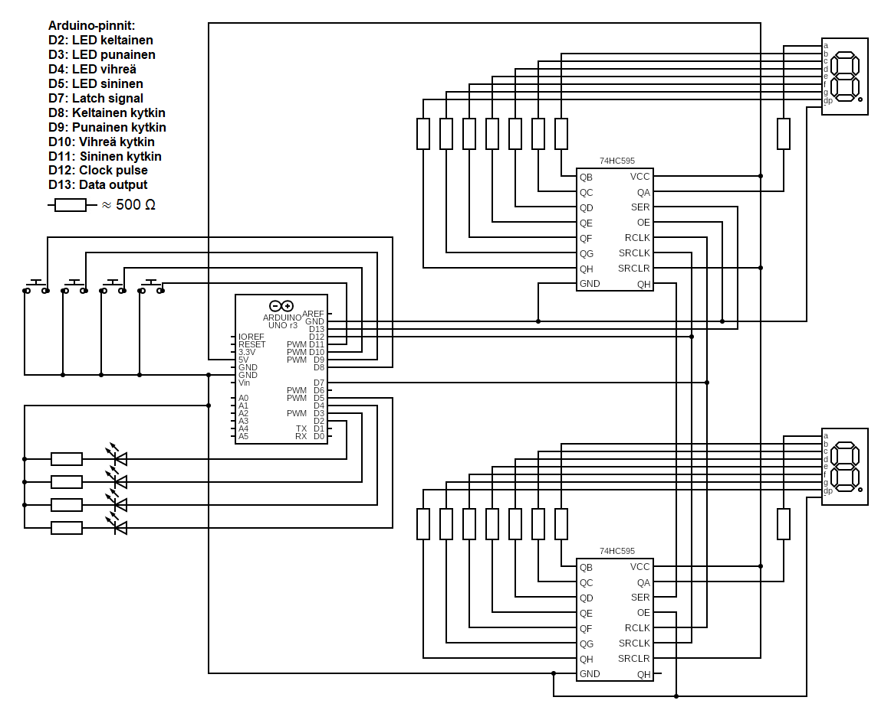
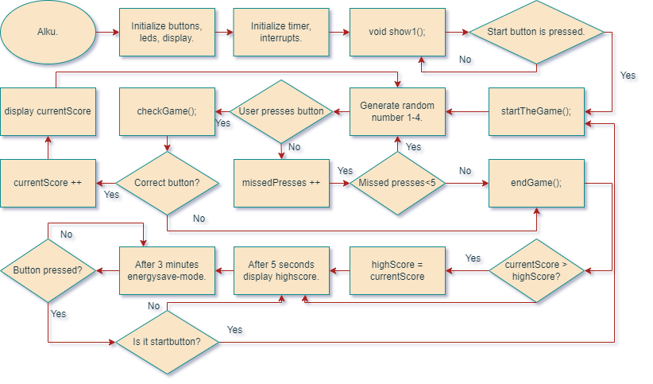

<!-- Readme:n muokkaukseen apuja: https://docs.github.com/en/repositories/managing-your-repositorys-settings-and-features/customizing-your-repository/about-readmes -->

<!-- Badget osoitteesta: https://shields.io/badges -->
  

<!--  -->

# Speden Spelit

**Speden Spelit** on nopeustestipeli, joka testaa pelaajan reaktiotaitoja. Peli on toteutettu Arduino-mikrokontrollerilla ja se sisältää LED-valoja, nappeja sekä pistetilanteen näyttävät näytöt.

## Sisältö

[1. Johdanto ja projektin tavoitteet](#1-johdanto-ja-projektin-tavoitteet)

[2. Projektin tausta ja rajoitukset](#2-projektin-tausta-ja-rajoitukset)

[3. Käytetyt tekniikat, komponentit ja työkalut](#3-käytetyt-tekniikat-komponentit-ja-työkalut)

[4. Projektirakenne ja laitteiston yksittyiskohdat](#4-projektirakenne-ja-laitteiston-yksityiskohdat)

[5. Ominaisuudet](#5-ominaisuudet)

[6. Ongelmat ja ratkaisut](#6-ongelmat-ja-ratkaisut)

[7. Repositoryn rakenne](#7-repositoryn-rakenne)

[8. Asennus](#8-asennus)

[9. Käyttö](#9-käyttö)

[10. Arviointi](#10-arviointi)

[11. Lisenssi](#11-lisenssi)

[12. Tekijät](#12-tekijät)

[13. Lähteet](#13-lähteet)

## 1. Johdanto ja projektin tavoitteet

Tämä projekti on osa Oulun ammattikorkeakoulun "Tietotekniikan sovellusprojekti" -kurssia. Projektin tavoitteena oli kehittää reaktionopeutta testaava peli Arduinon avulla. Projektin myötä opittiin mikroprosessoreiden käytön perusteista, ohjelmoinnista ja laitteiston hallinnasta. Lisäksi harjoiteltiin dokumentointia ja ryhmätyötaitoja

## 2. Projektin tausta ja rajoitukset

Alkuperäinen SpedenSpelit on suomalainen reaktiopeli, joka tuli tunnetuksi Speden Spelit -TV-ohjelmassa (1988–2002). Alun perin Harri Monosen ja Seppo Korhosen kehittämä peli valikoitui osaksi ohjelmaa nopeustestilaitteena ja se oli ohjelmassa mukana yli kymmenen vuoden ajan. Peli valittiin myös Suomen pelimuseoon sadan merkittävän suomalaisen pelin joukkoon, ja vuonna 2021 se lisättiin myös Urheilumuseon päänäyttelykokoelmaan e-urheiluosaston yhteyteen. (Coinline 2024)

Projekti perustuu samaiseen SpedenSpelit reaktiopeliin, jossa pelaajan tulee painaa oikeita nappeja syttyvien LED-valojen mukaisessa järjestyksessä tarpeeksi nopeasti. Peli vaikeutuu kierros kierrokselta nopeuttaen valojen syttymistä. Projektin käytössä oli rajoitettu määrä komponentteja, jotta se pysyisi yksinkertaisena ja käyttäjäystävällisenä sekä olisi rakennettavissa ja hallittavissa tähän asti opituilla taidoilla. Projektissa käytettiin Arduino Uno -mikrokontrolleria, joka on monipuolinen ja avoin kehitysalusta, jonka käytön harjoittelu kuuluu myös opetussuunnitelmaan. Projekti rajoittui peruskomponentteihin, jotta se olisi hallittavissa sekä rakenteellisesti että teknisesti. 

## 3. Käytetyt tekniikat, komponentit ja työkalut

Pelin rakentamisessa käytettiin seuraavia komponentteja ja työkaluja:
- **Arduino Uno** mikrokontrolleri
- **LED-valot ja painonapit** pelin visualisoimiseen ja hallintaan
- **7-segmenttinäytöt ja siirtorekisterit** pistetilanteen ja High Scoren näyttämiseen
- **Hyppylangat, johdotukset ja juotoslauta/koekytkentäalustat** piirin kokoamiseen 
- Koodi on kirjoitettu C/C++-kielellä ohjelmilla **Visual Studio Code** ja **Arduino IDE**

## 4. Projektirakenne ja laitteiston yksityiskohdat
Projekti jakautuu neljään päämoduuliin:
- **SpedenSpelit** – Sisältää pelilogiikan, kuten pelin aloittamisen ja vaikeutumisen
- **Buttons** - Hallinnoi painonappien syöttöjä.
- **Display** - Näyttää pelitulokset ja High Scoren
- **Leds** - Hallinnoi LEDien sytyttämistä.

### **Laitteiston yksityiskohdat:**
Laitteistosta on kaksi fyysistä versiota. Toinen on juotettu versio, joka on sijoitettu 3D-tulostetun laatikon sisälle. Toinen versio on rakennettu koekytkentäalustoille. Molemmissa versioissa on kytkennät Arduinolle, LEDeille, painonapeille, siirtorekistereille ja 7-segmenttinäytöille.

### **Laitteisto ja komponentit:**
- **Arduino Uno Rev 3:** Mikrokontrolleri, joka ohjaa LED-valoja, nappeja ja näyttöjä sekä toteuttaa pelin logiikan. Arduino on yhdistettynä tietokoneeseen **USB 3.0 kaapelilla.**
- **LED-valot:** Neljä värillistä LED-valoa: punainen, keltainen, vihreä, sininen
- **Painikkeet:** Neljä painonappia (Panasonic ESE20C321) 
- **7-segmenttinäytöt:** Kaksi 7-segmenttinäyttöä (KINGBRIGHT SC52-11EWA), jotka näyttävät pelin pisteet ja ennätyspisteet
- **Siirtorekisterit:** Kaksi 74HC595 siirtorekisteriä, jotka ohjaavat 7-segmenttinäyttöjä.
- **Vastukset:** 220 Ω – 4,7 kΩ, virrankulun säätely 7-segmenttinäytöille ja LEDeille
- **Hyppylangat:** Lajitelma eripituisia uros-uros hyppylankoja komponenttien yhdistämiseen koekytkentäalustoilla.
- **Koekytkentäalustat**
- **Juotoslauta:** Multicomp PRO PCB Hi density single eurocard
- **Virtalähde:** Arduino sai virran tietokoneen USB-portin kautta.

### **Ohjelmisto:**
- **Visual Studio Code:** Pääasiallinen ohjelmointiympäristö C/C++-kielisen koodin kirjoittamiseen. Ohjelmistoon oli asennettu laajennukset: Arduino v0.0.4 (moozzyk), Arduino Community Edition v0.7.2 (vscode-arduino), GitLens - Git Supercharged v15.6.1 (GitKraken), Serial Monitor v0.13.1 (Microsoft).
- **Arduino IDE 2.3.3:** Ohjelmistoympäristö, jota käytettiin VS Codessa ohjelmoinnin tukena.
- **GitHub:** Projektin versionhallinta ja julkaisu
- **Kaavioiden piirtäminen:** 
     - **draw.io:** vuokaaviot 
     - **circuit-diagram.org:** piirikaaviot
- **Wokwi:** Pelin simulointi
- **Microsoft Teams:** Projektin hallinta, tiedonjako ja ryhmätyöskentely.
- **ChatGPT ja Gemini:** Tekoälytyökalut työskentelyn tukena
- **Shields.io:** Palvelu tunnusmerkkien (badge) luomiseen, jotka on esillä projektin GitHubin sivulla
- **Autodesk Fusion:** Kotelon 3D-mallinnus
- **OrcaSlicer:** 3D-mallin viipalointiohjelma (slicer), jonka avulla malli saadaan 3D-tulostimen ymmärtämään muotoon

## 5. Ominaisuudet

### **Perustoiminnot**
Peli käynnistyy, kun oikeanpuoleisinta (sinistä) nappia painetaan, ja se jatkuu niin pitkään, kunnes pelaaja tekee virheen. Pelaaja seuraa LED-valoja, jotka syttyvät satunnaisessa järjestyksessä, ja painaa vastaavia nappeja. Jos pelaaja painaa väärää nappia, kaikki LED-valot syttyvät Game Over -merkiksi. Pistetulos kasvaa, kun pelaaja reagoi oikein vaihtuviin LED-valoihin ja painelee valoja vastaavia nappeja tarpeeksi nopeasti.

### **Pelin eteneminen ja vaikeutuminen**
Peli vaikeutuu pelaajan edistyessä. Kun pelaaja on painanut kymmenen oikeaa painallusta, pelin nopeus kasvaa 10 %. Ajastin nopeutuu joka kymmenennen painalluksen jälkeen: valot syttyvät nopeammin ja reaktioaika lyhenee. Peli jatkuu, kunnes pelaaja tekee virheen ja painaa väärää nappia.
Pisteiden seuranta ja näyttö
Oikeasta painalluksesta pelaaja saa yhden pisteen, joka päivittyy heti 7-segmenttinäytölle siirtorekisterin kautta. Näytöllä oleva pistemäärä kertoo reaaliaikaisesti pelaajan edistymisestä. 

### **High Score -toiminto**
Pelin päättymisen jälkeen ohjelma tarkistaa, onko pelaajan saavuttama nykyinen pistemäärä suurempi kuin aikaisempi High Score (ellei kyseessä ole ensimmäinen pelikerta, jolloin ennätys on ensimmäisen pelikerran tulos). Jos pistemäärä on suurempi, kuin edellinen ennätys, se tallentuu EEPROMiin, missä ennätys säilyy muistissa myös pelisessioiden välillä (Arduino 2024a). Ennätys näytetään aina kun peli käynnistetään ja peli ei ole juuri sillä hetkellä käynnissä.

### **Virransäästötila**
Jos peliä ei käytetä 300 millisekuntiin, se siirtyy virransäästötilaan. Tässä tilassa kaikki LED-valot ja näytöt sammuvat, mikä vähentää virrankulutusta. LED vilkkuu merkkinä siitä, että peli on virransäästötilassa. Peli poistuu virransäästötilasta, kun mitä tahansa nappia painetaan, jolloin näyttö aktivoituu ja piste-ennätys (High Score) tulee takaisin näkyviin. Pelaaja voi käynnistää pelin uudelleen painamalla reunimmaista nappia oikealla (sininen nappi).

## 6. Ongelmat ja ratkaisut
Peliä ja sen toimintaa testattiin projektin edetessä sekä simulaattorissa että fyysisesti. Yksittäisiä komponentteja (LED-valot, napit, näytöt) testattiin ensin erikseen ja sitten yhdessä, jotta voitiin varmistua niiden toimivuudesta. Testeissä tarkasteltiin pelin ominaisuuksia, kuten pelin nopeutta, pisteiden seurantaa ja ennätyspisteiden säilymistä muistissa. Testit auttoivat hienosäätämään peliä haluttuun suuntaan. 

Pelin kehittämisen aikana ilmeni muutamia ongelmia, joihin lukeutui mm. High Scoren tallentamisen toteuttaminen, LED-valojen kytkennät ja debounce-ilmiö. Nämä ratkaistiin perusteellisella vianmäärityksellä ja koodin tarkistuksella. High Score -ongelma ratkaistiin säilyttämällä tiedot muistissa EEPROMin avulla, kun taas debounce-ilmiö korjattiin käyttämällä mm. millis()-funktiota, joka kirjaa painikkeen painamisesta kuluneen ajan ja estää näin virheelliset syötteet (Arduino 2024b). 

Lopputuloksen osalta voidaan sanoa, että projektin tavoitteena ollut nopeutta testaava peli saatiin toimimaan. Koodissa oli aluksi virheitä, jotka kuitenkin saatiin kaikki korjattua. Pelin toiminta on testattu, todettu toimivaksi ja se vastaa alkuperäisiä tavoitteita. Koodin kehitys eteni melko sujuvasti ja peli on testattu toimivaksi luotettavasti. Suurimmat haasteet liittyivät alkuvaiheen bugeihin ja ajanhallintaan.

Tulevaisuudessa peliä voisi kehittää lisäämällä sille uusia ominaisuuksia, kuten äänet tai erilaisia vaikeustasoja. Nykyinen projekti rakennettiin koekytkentäalustoja käyttäen. Kyseinen versio on täysin toimiva ja riittää hyvin projektin tavoitteiden saavuttamiseen. Jos vastoinkäymisiä ei olisi tapahtunut, olisi tälle projektille tehty 3D-tulostettu laatikko ja juotettu versio ollut parempi  lopputulos ja se olisi mahdollistanut projektin kytkennän viimeistelyn huolitellummaksi. Koekytkentäalustalle toteutettu versio on täysin toimiva ja riittää hyvin projektin tavoitteiden saavuttamiseen, mutta siinäkin olisi voinut hioa kytkennän siistiyttä varautumalla kattavammalla valikoimalla hyppylankoja ja vaihtamalla valkoiset napit värillisiin painonappeihin.

## 7. Repositoryn rakenne
- .github/workflow - Automaattiset työnkulut
- Dokumentit/ - Kuvat, kaaviot ja muut dokumentit
- SpedenSpelit/ - Pelin lähdekoodi
- .gitignore - Tiedostot, joita Git ei seuraa
- LICENSE - Projektin lisenssi
- README.md - Tämä tiedosto

## 8. Asennus

### **Tarvittavat välineet ja materiaalit:**
- **Ohjelmisto:** Arduino IDE (https://www.arduino.cc/en/software)
- **Arduino Uno:** tai vastaava Arduino-yhteensopiva piirikortti ja USB 3.0 tai 2.0 kaapeli
- **Koekytkentäalusta:** Vähintään kaksi 400-kytkentäpisteen alustaa
- **Komponentit:** 
     - 2 kpl 7-segmenttinäyttöä (esim. KINGBRIGHT SC52-11EWA)
     - 2 kpl 74HC595 siirtorekisteriä
     - 4 kpl painonappia (esim. Panasonic ESE20C321)
     - 16 kpl vastuksia (esim. 220 Ω) 7-segmenttinäytöille
     - 4 kpl vastuksia (noin 500 Ω) LED-valoille
     - Uros-uros hyppylankoja

### **Lähdekoodin lataaminen ja asennus**
1. Lataa SpedenSpelit kansio ja tallenna tiedosto tietokoneelle
2. Käynnistä Arduino IDE -ohjelma ja avaa tiedosto ”SpedenSpelit.ino”, joka sisältää pääohjelman. 
3. Tarkista, että Arduino IDEssä on valittuna portti, johon Arduino on kytketty (”Tools” -> ”Port”)
4. Tarkista koodi painamalla vasemmassa yläkulmassa olevaa ”Verify”-nappia (kuvakkeessa on nuoli oikealle) varmistaaksesi, että koodi on kunnossa.
5. Aja koodi sisään Arduinolle painamalla ”Upload”-painiketta

### **Kytkentä**
1. Valmistele komponentit: Kerää kaikki tarvittavat komponentit ja koekytkentäalustat.
2. Kytke komponentit: Seuraa kytkentäkaaviota ja kytke komponentit koekytkentäalustoille. 
3. Kytke Arduino: Kytke Arduino koekytkentäalustaan hyppylankojen avulla.
4. Yhdistä tietokoneeseen: Kytke Arduino tietokoneeseen USB-kaapelilla.

### **Pelin pelaaminen**
Kun koodi on ladattu Arduinoon ja kytkentä on valmis, voit aloittaa pelin painamalla oikeanpuoleisinta painonappia.

HOX! Jos kohtaat ongelmia, tarkista ensin, että kaikki kytkennät ovat oikein ja että olet valinnut oikean portin Arduino IDE:ssä. Voit myös yrittää etsiä ratkaisuja Arduino-foorumeilta tai muista lähteistä. 
Jos haluaa pysyvän version pelistä, komponentit voi juottaa yhteen. Juottaminen vaatii erityistä huolellisuutta ja työkaluja, sekä taidot toteutukseen.

## 9. Käyttö

### **Pelin logiikka**

### **Pelin käynnistäminen ja lopettaminen**
- Käynnistäminen: Peli alkaa painamalla reunimmaista nappia oikealla (sininen nappi) laitteen ollessa päällä. 
- Lopettaminen: 
     - Väärä vastaus: Jos painat väärää nappia, peli päättyy ja kaikki LED-valot syttyvät hetkeksi ilmoittaen pelin päättymisestä.
     - Aikaraja: Jos et paina nappia noin 5 sekunnin sisään, peli päättyy automaattisesti.
     - Virran katkaisu: Voit lopettaa pelin irrottamalla Arduinon  tietokoneesta.

### **Pelin kulku**
- Pelaaminen: Seuraa LED-valojen syttymisjärjestystä ja paina vastaavia nappeja.
- Pisteet: Pisteet päivittyvät reaaliaikaisesti 7-segmenttinäytölle jokaisen oikean painalluksen  jälkeen.
- Nopeutuminen: Pelin yksi kierros kestää kymmenen painallusta. Peli nopeutuu automaattisesti 10 % jokaisen kierroksen jälkeen. Pelin nopeutuminen havaitaan nopeammin syttyvistä LED-valoista, jolloin myös pelaajalla on vähemmän aikaa reagoida.
- High Score: Korkein saavutettu pistemäärä (ennätys) näytetään 7-segmenttinäytöllä laitteen ollessa päällä ja virransäästötilan jälkeen kun peli ei sillä hetkellä pelattavana.

### **Virransäästötila**
- Aktivoituminen: Jos mitään nappia ei paineta 3 minuuttiin, peli siirtyy virransäästötilaan. Tällöin 7-segmenttinäytöt sammuvat ja yksi LED alkaa vilkkua.
- Herättäminen: Peli herää, kun mitä tahansa nappia painetaan

## 10. Arviointi

Projektin tavoitteena oli luoda Arduinon avulla reaktionopeutta mittaava peli. Pelin perustoiminnon lisäksi siihen tuli kehittää jokin lisäominaisuus, kuten esimerkiksi High Score, virransäästö tai äänet. Tämän projektin yhteyteen kehitettiin lisäominaisuuksina High Score ja virransäästö. 

Koodaus eteni sujuvasti ja suurimmat ongelmat liittyivät alkuvaiheen bugeihin, jotka saatiin kuitenkin ratkaistua yhteistyöllä. Hardware-puolella 3D-tulostetun kotelon ja pelin kokoamisen kanssa ilmeni haasteita, koska napit sulivat, mutta vaihtoehtoinen ratkaisu löydettiin käyttämällä koekytkentäalustoilla tehtyä kytkentää. 

Ryhmässä tehtävät jaettiin ryhmäläisten vahvuuksien mukaan ja ajankäyttö suunniteltiin niin, että työmäärä jakautui melko tasaisesti, mikä auttoi projektia edistymään tehokkaasti. Ryhmä piti viikoittaisia viikkopalavereja ja teki ahkerasti yhteistyötä myös ryhmän StudyGroupin Discord-kanavalla. Arduinon ohjelmointitaitojen ja elektronisten komponenttien hallinnan lisäksi projekti opetti ajanhallintaa ja projektinhallintaa. Joonatanin ja Juhon kyky hallita ajankäyttöä ja ratkaista ongelmia oli merkittävä etu projektin onnistumiselle. Joonatan osoitti erinomaista projektinjohtamistaitoa ja opetti koko ryhmälle paljon uutta. Joonatan oli myös oman ammattikokemuksensa ansiosta enemmän vastuussa koodista ja pelin logiikasta sekä VS Coden ja GitHubin opettamisesta. Juho oli koodauksen ja vuokaavioiden parissa vahva tuki. Elin hoiti suurimmaksi osaksi projektin dokumentointiin liittyvät tehtävät.

Projekti kartutti kokemusta elektroniikasta ja laitteiston kokoamisesta. Projektin aikana syvennettiin osaamista Arduino-ohjelmoinnista ja opittiin lisää mm. LED-valojen ohjauksesta, painonappien ja 7-segment näyttöjen käytöstä sekä vianmäärityksestä. Vianmääritys oli hyvin opettavaista etenkin ongelmanratkaisutaitojen suhteen. Projektin aikana valmistunut peli oli kytkennöiltään ja toteutukseltaan tähän asti monimutkaisin verrattuna aiempien kurssien tehtäviin. Ryhmätyöskentelyn osalta kokemusta karttui työtehtävien jakamisesta ja tehokkaasta ryhmässä kommunikoimisesta.  Reippaalla tahdilla valmistunut koodi ja toimiva ryhmätyöskentely olivat tärkeässä asemassa hyvän lopputuloksen aikaansaamiseksi.

Projektin heikkouksina voisi mainita aikataulutuksen, työnjaon ja 3D-tulostetun kotelon ongelmat. Työ oli jaettu ryhmäläisten vahvuuksien mukaan, jolloin kunkin osa-alueen taitaja pystyi opettamaan paljon muita, mutta toisinaan on tärkeää myös haastaa itseään oppiakseen uutta tehokkaasti. Voi olla, että ryhmäläiset olisivat kehittyneet enemmän itselleen heikoimmilla osa-alueilla, jos vahvuuksien perässä ei olisi menty niin voimakkaasti. Joonatanin ja Juhon ajankäytön suunnittelu ja hallinta toimi täsmällisesti. Elinillä oli haasteita pysyä suunnitellussa aikataulussa ja suuri osa työstä jäi viime tippaan. On harmi, että 3D-tulostettuun laatikkoon tullut laitteen kokoonpano kärsi sulaneista napeista, mutta onneksi sille löydettiin ratkaisu käyttämällä toista fyysistä kokoonpanoa. Viime kädessä projektista oli myös toimiva simulaatio, jolla projektia voi tarkastella ja testata. 

Jatkossa olisi hyvä jatkaa huolehtimalla ajankäytön suunnittelusta ja suunnitelmassa pysymisestä. Tässä Joonatan ja Juho ovat oivallisia esimerkkejä. Suunnittelemalla ajankäyttö tarkemmin aikaisemmassa vaiheessa projektia työmäärä olisi helpompi jakaa tasaisemmin pidemmälle aikavälille, jolloin projekti ei tuntuisi yhtä työläältä. Lisäksi voisi olla parempi pitää tarkempaa kirjaa haasteista, ongelmista ja niiden ratkaisuista, jotta niistä voisi oppia enemmän. Jos haluaa haastaa itseään, voi jatkossa myös ottaa useamman lisäominaisuuden tai kenties haastavamman lisäominaisuuden työn alle. 

## 11. Lisenssi

Tämä projekti on lisensoitu GNU General Public License v3.0 -lisenssillä. Lisätietoja lisenssin ehdoista [täällä](/LICENSE)

## 12. Tekijät

Tämän projektin toteuttivat Oulun ammattikorkeakoulun opiskelijat:
- Joonatan
- Juho
- Elin

## 13. Lähteet

Arduino 2024a. EEPROM Library. Luettavissa: https://docs.arduino.cc/learn/built-in-libraries/eeprom/. Luettu 24.9.2024

Arduino 2024b. Debounce on a Pushbutton. Luettavissa: https://docs.arduino.cc/built-in-examples/digital/Debounce/. Luettu 23.9.2024

Coinline 2024. Nopeustesti -peli. Luettavissa: https://www.coinline.fi/nopeustesti-peli/. Luettu 15.10.2024